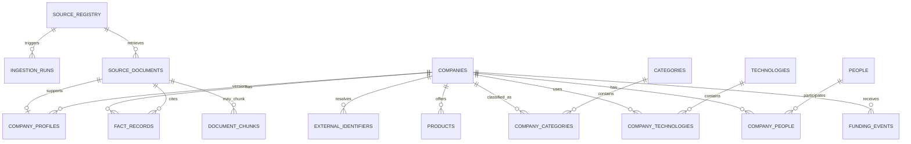

# Data model

The database uses schemas as ownership boundaries. `raw` is append-oriented evidence and operations metadata; `core` is normalized/versioned research data; `staging`, `intermediate`, and `analytics` are built by dbt.

## Lineage

## Raw/operations tables

### `raw.source_registry`

The default-deny allowlist. `(source_type, external_key)` is unique. A connector requires `enabled = true` and `review_status = 'approved'`. Review provenance, collection method, terms/robots URLs, attribution, retention mode, ETag, rate-limit state, and last check/success timestamps are first-class fields.

### `raw.ingestion_runs`

One row per domain ingestion attempt, independent of Prefect's state store. Status is `started`, `succeeded`, `unchanged`, or `failed`. Failures keep a bounded exception type/message but never a response body or credential. `requested_as_of` is an operational partition label; it does not assert that a current-state API returned historical data.

### `raw.source_documents`

A source response identified by `(source_id, external_id, SHA-256)`. It stores canonical URL, retrieval/check timestamps, HTTP validators, safe rate metadata, attribution, and—only under `full_response` retention—JSON content. A repeated semantic payload updates check/run metadata but does not create another row.

## Core tables

### Identity and profile

- `core.companies`: stable project identity (`slug`) and current display defaults.
- `core.external_identifiers`: unique provider IDs that survive display-name changes.
- `core.company_profiles`: source-backed profile versions; `source_document_id` is unique, so one document cannot create duplicate profile versions.

### Evidence

`core.fact_records` records subject, predicate, JSON value, evidence type, extraction method/version, observation time, and source document. Allowed evidence types are:

- `direct_fact`: copied/normalized from a cited external response.
- `derived_classification`: future non-generative or statistical output.
- `model_interpretation`: future LLM synthesis.

A database check requires every direct fact to have a source-document citation. The first milestone writes only `direct_fact`.

### Reserved normalized entities

`products`, `categories`, `technologies`, `people`, `company_people`, and `funding_events` establish explicit cited boundaries for future reviewed connectors. They remain empty in this milestone. Empty is preferable to synthetic or weakly sourced data.

### Vector boundary

`core.document_chunks` uses pgvector's unconstrained `vector` type and records the embedding model alongside each embedding. It is intentionally empty. A dimension/index/model decision follows retrieval evaluation; the project does not imply that semantic retrieval exists yet.

## dbt relations

- `dev_staging.stg_companies`: stable identities in the default local target.
- `dev_staging.stg_company_profiles`: versions joined to citation metadata.
- `dev_staging.stg_fact_records`: typed assertions without coercion.
- `dev_intermediate.int_company_profiles_ranked`: deterministic per-company recency rank.
- `dev_analytics.company_research_profiles`: one current cited profile per company.

The schema prefix comes from `DBT_SCHEMA`; CI and production must use distinct prefixes.

Generic and singular dbt tests enforce keys, required citations, relationships, accepted evidence types, and one current profile. Freshness thresholds warn after two days and error after seven for this demonstration; production thresholds must be source-specific.

## Retention and evolution

Raw retention is source-specific. Deleting a source document requires an explicit policy because normalized facts reference it. Before collaborative schema evolution, replace the bootstrap-only approach with Alembic migrations and add restricted writer/reader/dbt database roles. Before embeddings, add an embedding configuration table and a dimension-specific index only after a model has been selected by measured retrieval performance.
